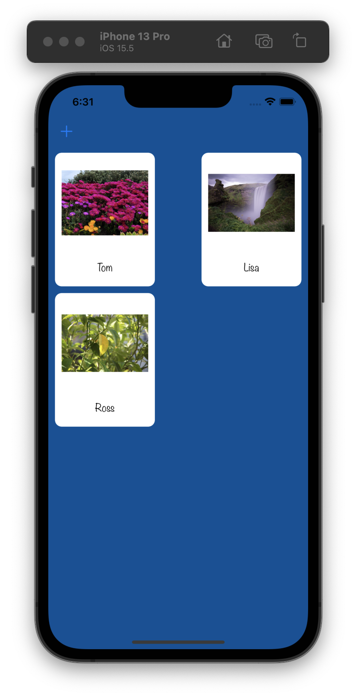
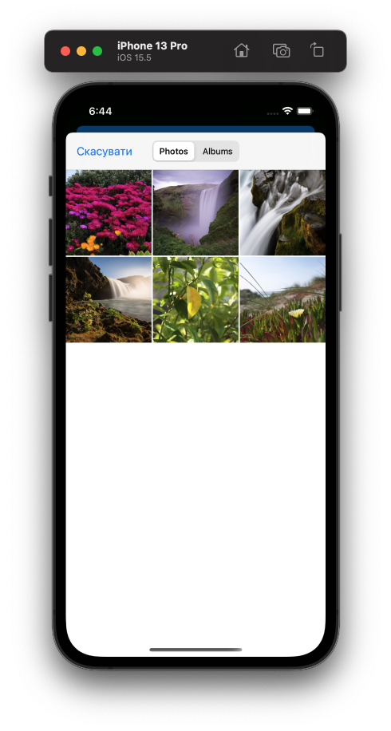
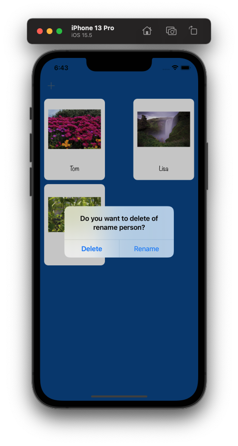
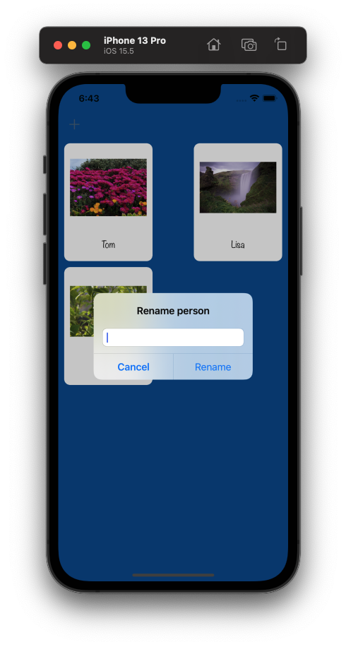

# NamesToFaces

Application implemented during passing 100 day of swift course

## Description

This is simple and useful app that will help users to store names of people they've met.
If you're a frequent traveller, or perhaps just bad at putting names to faces, this application will be perfect for you.

## Used technologies

- UICollectionView
- UIImagePickerView
- UUID

## Usage

